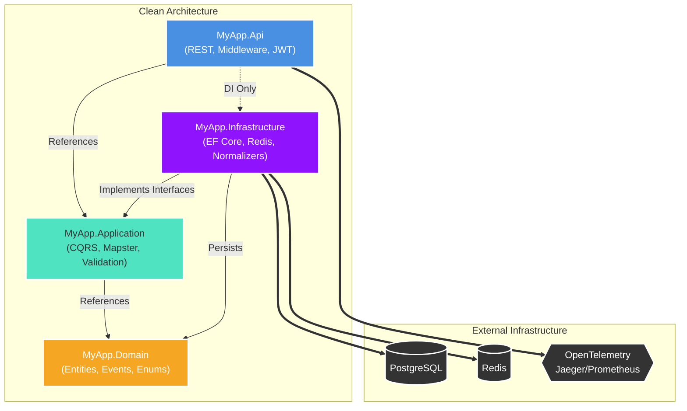

# Cloud Billing Telemetry Microservice

> **Enterprise-grade ASP.NET Core 10 microservice** that ingests, normalizes, and serves cloud billing telemetry from AWS, Azure, and GCP — built on Clean Architecture with CQRS, MediatR, EF Core 9, Redis, and full observability.

---

## Architecture



## Tech Stack

| Concern           | Technology                                |
|-------------------|-------------------------------------------|
| API Framework     | ASP.NET Core 10 (`net10.0`)               |
| CQRS / Events     | MediatR 12                                |
| ORM               | EF Core 9 + Npgsql (PostgreSQL)           |
| Caching           | Redis (StackExchange.Redis)               |
| Validation        | FluentValidation 11                       |
| Mapping           | Mapster 7.4                               |
| Auth              | JWT Bearer                                |
| Rate Limiting     | ASP.NET Core Built-in                     |
| Logging           | Serilog (Console + Seq)                   |
| Observability     | OpenTelemetry → Jaeger + Prometheus       |
| Testing           | xUnit + Moq + FluentAssertions            |
| Containerization  | Docker + Docker Compose + Testcontainers  |

## Supported Cloud Providers

| Provider | Billing Format                    |
|----------|-----------------------------------|
| **AWS**  | Cost and Usage Report (CUR) JSON  |
| **Azure**| Cost Management Export JSON       |
| **GCP**  | Billing Export (BigQuery JSON)    |

---

## Quick Start

### Local (Docker Compose) - Full Stack

The easiest way to run the entire backend with all dependencies (PostgreSQL, Redis, Jaeger, Prometheus, Grafana).

```bash
# 1. Start all services in the background
docker compose up -d

# 2. Monitor startup
docker compose logs -f api

# 3. View Interfaces
# Swagger UI        : http://localhost:8080/swagger
# Jaeger Tracing    : http://localhost:16686
# Prometheus Metrics: http://localhost:9090
# Grafana Dashboards: http://localhost:3000 (admin / admin)
```

### Local Development (dotnet SDK)

If you prefer to run the .NET app natively on your host machine while keeping databases in Docker container:

```bash
# 1. Install prerequisites: .NET 10 SDK and Docker Desktop
# 2. Spin up just the infrastructure services without the API:
docker compose up -d postgres redis jaeger prometheus grafana

# 3. Configure local environment variables
cp .env.example .env

# 4. Restore dependencies and run migrations
cd MyApp.Api
dotnet restore
dotnet ef database update --project ../MyApp.Infrastructure

# 5. Run the API locally
dotnet run
# The API will automatically pick up connections to localhost:5432 (PG) and localhost:6379 (Redis)
```

---

## API Reference

### Ingestion Endpoints

| Method | Path                        | Description                    |
|--------|-----------------------------|--------------------------------|
| `POST` | `/api/v1/billing/ingest`    | Ingest a single billing record |
| `POST` | `/api/v1/billing/ingest/batch` | Ingest up to 1000 records   |

#### Single Ingest — Example Request (AWS)

```json
POST /api/v1/billing/ingest
Content-Type: application/json

{
  "provider": "AWS",
  "accountId": "123456789012",
  "correlationId": "req-abc123",
  "rawPayload": {
    "lineItem/UnblendedCost": "12.3456",
    "lineItem/CurrencyCode": "USD",
    "lineItem/UsageAmount": "100",
    "lineItem/UsageUnit": "Hrs",
    "lineItem/ProductCode": "AmazonEC2",
    "product/region": "us-east-1",
    "lineItem/UsageStartDate": "2024-01-01T00:00:00Z",
    "lineItem/UsageEndDate": "2024-01-02T00:00:00Z"
  }
}
```

### Query Endpoints

| Method | Path                        | Description                         |
|--------|-----------------------------|-------------------------------------|
| `GET`  | `/api/v1/billing/records`   | Paginated list with filters         |
| `GET`  | `/api/v1/billing/aggregate` | Cost aggregation over a time period |

#### Query Records — Example

```
GET /api/v1/billing/records?accountId=123456789012&provider=AWS&from=2024-01-01&page=1&pageSize=50
```

#### Aggregate — Example

```
GET /api/v1/billing/aggregate?accountId=123456789012&from=2024-01-01&to=2024-02-01
```

---

## Running Tests

The test suite covers Unit, Integration, and End-to-End flows.

```bash
# 1. Run all tests in the solution
dotnet test MyApp.sln --logger "console;verbosity=detailed"

# 2. Run strictly Unit tests (no external dependencies required)
dotnet test --filter "Category=Unit"

# 3. Run Integration/E2E tests 
# The E2E suite uses WebApplicationFactory for API-level verification.
# Note: Test dependencies are mocked to In-Memory components ensuring 
# the E2E tests execute successfully across CI/CD and environments without Docker.
dotnet test MyApp.Tests/MyApp.Tests.csproj --filter "FullyQualifiedName~E2E"

# 4. Generate coverage reports
dotnet test --collect:"XPlat Code Coverage"
```

---

## EF Core Migrations

If you make changes to the domain entities, generate and apply a new migration:

```bash
cd MyApp.Api
dotnet ef migrations add <YourMigrationName> --project ../MyApp.Infrastructure
dotnet ef database update
```

---

## Observability

- **Traces** → Jaeger at `http://localhost:16686`
- **Metrics** → Prometheus scrapes `/metrics`; Grafana at `:3000`
- **Logs** → Serilog structured JSON; optionally ship to Seq at `:5341`
- **Health** → `GET /health` (checks PostgreSQL + Redis)
- **Correlation IDs** → Every request tagged with `X-Correlation-Id`

---

## Project Structure

```
aspnet-enterprise-api/
├── MyApp.Api/                     # ASP.NET Core Web host
│   ├── Controllers/               # Ingestion + Query endpoints
│   ├── Middleware/                # Exception handling, Correlation ID
│   ├── Program.cs                 # Full DI wiring
│   └── appsettings.json
├── MyApp.Application/             # Use-cases (CQRS)
│   ├── Commands/                  # IngestBillingRecord, IngestBillingBatch
│   ├── Queries/                   # GetBillingRecords, GetBillingAggregate
│   ├── Behaviors/                 # Logging, Validation MediatR pipeline
│   ├── Validators/                # FluentValidation
│   ├── Mappings/                  # Mapster mapping configurations
│   ├── DTOs/                      # Request/response models
│   └── Interfaces/                # Repository + service contracts
├── MyApp.Domain/                  # Pure domain model
│   ├── Entities/                  # BillingRecord aggregate root
│   ├── ValueObjects/              # MoneyAmount, ServiceIdentifier
│   ├── Events/                    # BillingRecordIngested
│   └── Enums/                     # CloudProvider, BillingStatus
├── MyApp.Infrastructure/          # External services
│   ├── Persistence/               # EF Core DbContext + migrations
│   ├── Repositories/              # BillingRepository
│   ├── Services/                  # AWS/Azure/GCP normalizers
│   ├── Caching/                   # RedisCacheService
│   └── Extensions/                # DI registration
├── MyApp.Tests/
│   ├── Unit/                      # Domain, Application, Normalizer tests
│   ├── Integration/               # Repository tests against DB
│   └── E2E/                       # WebApplicationFactory API testing
├── infra/
│   └── prometheus.yml
├── Dockerfile                     # Multi-stage production build
├── docker-compose.yml             # Full local dev stack
└── .env.example
```
