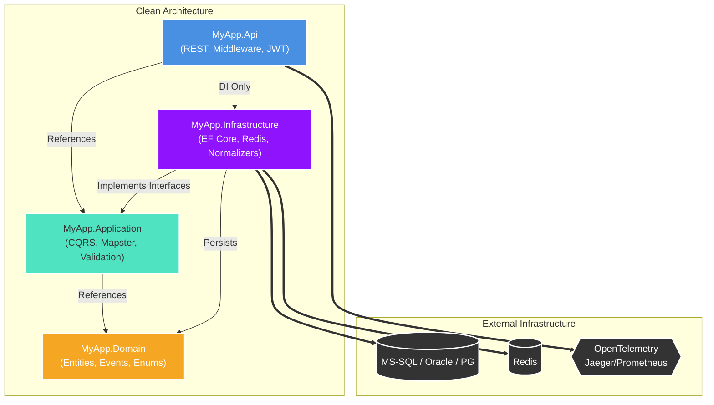

# ☁️ Cloud Billing Telemetry Microservice

[](#)
[](#)
[](#)

> **Enterprise-grade ASP.NET Core 10 microservice** that ingests, normalizes, and serves cloud billing telemetry from AWS, Azure, and GCP. Built on **Clean Architecture** patterns utilizing CQRS, MediatR, EF Core 9, Redis, and comprehensive observability integrations.

---

## 🏗 Architecture



## 🛠 Tech Stack

| Concern           | Technology                                  |
|-------------------|---------------------------------------------|
| **API Framework** | ASP.NET Core 10 (`net10.0`)                 |
| **CQRS / Events** | MediatR 12                                  |
| **ORM**           | EF Core 9 (Multi-Provider: MS-SQL, Oracle, PostgreSQL) |
| **Caching**       | Redis (StackExchange.Redis)                 |
| **Validation**    | FluentValidation 11                         |
| **Mapping**       | Mapster 7.4                                 |
| **Auth**          | JWT Bearer                                  |
| **Rate Limiting** | ASP.NET Core Built-in Rate Limiting         |
| **Logging**       | Serilog (Console + Seq sync)                |
| **Observability** | OpenTelemetry → Jaeger + Prometheus         |
| **Testing**       | xUnit + Moq + FluentAssertions              |
| **Deployment**    | Docker + Docker Compose + Testcontainers    |

## 🌍 Supported Cloud Providers

| Provider  | Billing Format                   | Status  |
|-----------|----------------------------------|---------|
| **AWS**   | Cost and Usage Report (CUR) JSON | ✅ Ready |
| **Azure** | Cost Management Export JSON      | ✅ Ready |
| **GCP**   | Billing Export (BigQuery JSON)   | ✅ Ready |

---

## 🚀 Quick Start

### Prerequisites
- **Docker Desktop** / **Docker Daemon** (v20.10+)
- **.NET 10 SDK** (If running locally instead of Docker)

### Option A: Local Full Stack (Docker Compose) - *Recommended*

The easiest way to run the entire backend with all dependencies out-of-the-box (PostgreSQL, Redis, Jaeger, Prometheus, Grafana).

```bash
# 1. Start all services in the background mode
docker compose up -d --build

# 2. Monitor startup logs
docker compose logs -f api
```

#### 🌐 Port Mappings & Interfaces

Once the stack is spun up, the following services will be available:

| Service               | Interface / Endpoint                   | Credentials       |
|-----------------------|----------------------------------------|-------------------|
| **API Swagger UI**    | [http://localhost:8080/swagger](http://localhost:8080/swagger) | -                 |
| **Jaeger Tracing**    | [http://localhost:16686](http://localhost:16686)        | -                 |
| **Prometheus Metrics**| [http://localhost:9090](http://localhost:9090)          | -                 |
| **Grafana Dashboards**| [http://localhost:3000](http://localhost:3000)          | `admin` / `admin` |
| **MS-SQL Server**     | `localhost:1433`                       | `sa` / `YourStrong@Password` |
| **Oracle DB**         | `localhost:1521`                       | `system` / `YourStrong@Password` |
| **PostgreSQL DB**     | `localhost:5432`                       | `billing_user` / `billing_pass` |
| **Redis Cache**       | `localhost:6379`                       | -                 |

> [!NOTE] 
> By default, the application is configured to run **Microsoft SQL Server**. To switch to Oracle or PostgreSQL, simply update the `DatabaseProvider` key in `appsettings.json` and optionally uncomment the respective container blocks inside `docker-compose.yml`.

### Option B: Local Native Development (dotnet SDK)

If you prefer to run the .NET app natively on your host machine but keep the infrastructure dependencies in docker containers:

```bash
# 1. Spin up just the infrastructure services without the API:
docker compose up -d mssql redis jaeger prometheus grafana

# 2. Configure local environment variables
cp .env.example .env

# 3. Restore dependencies and run migrations
cd MyApp.Api
dotnet restore
dotnet ef database update --project ../MyApp.Infrastructure

# 4. Run the API locally
dotnet run
# The API will automatically pick up connections to localhost:1433 (MS-SQL) and localhost:6379 (Redis)
```

---

## 📡 API Reference

### 📥 Ingestion Endpoints

| Method | Path                           | Description                               |
|--------|--------------------------------|-------------------------------------------|
| `POST` | `/api/v1/billing/ingest`       | Ingest a single billing record            |
| `POST` | `/api/v1/billing/ingest/batch` | Ingest a batch (up to 1,000 records)      |

<details>
<summary><b>View Example Request (AWS Single Ingest)</b></summary>

```json
POST /api/v1/billing/ingest
Content-Type: application/json

{
  "provider": "AWS",
  "accountId": "123456789012",
  "correlationId": "req-abc123",
  "rawPayload": {
    "lineItem/UnblendedCost": "12.3456",
    "lineItem/CurrencyCode": "USD",
    "lineItem/UsageAmount": "100",
    "lineItem/UsageUnit": "Hrs",
    "lineItem/ProductCode": "AmazonEC2",
    "product/region": "us-east-1",
    "lineItem/UsageStartDate": "2024-01-01T00:00:00Z",
    "lineItem/UsageEndDate": "2024-01-02T00:00:00Z"
  }
}
```
</details>

### 🔍 Query Endpoints

| Method | Path                           | Description                               |
|--------|--------------------------------|-------------------------------------------|
| `GET`  | `/api/v1/billing/records`      | Paginated list with extensive filters     |
| `GET`  | `/api/v1/billing/aggregate`    | Cost aggregation over a specified period  |

#### Query Records — Example
```http
GET /api/v1/billing/records?accountId=123456789012&provider=AWS&from=2024-01-01&page=1&pageSize=50
```

#### Aggregate — Example
```http
GET /api/v1/billing/aggregate?accountId=123456789012&from=2024-01-01&to=2024-02-01
```

---

## 🧪 Testing

The solution is covered by an extensive test suite divided into Unit, Integration, and E2E flows.

```bash
# 1. Run all tests in the solution
dotnet test MyApp.sln --logger "console;verbosity=detailed"

# 2. Run strictly Unit tests (no external dependencies required)
dotnet test --filter "Category=Unit"

# 3. Run Integration/E2E tests 
# The E2E suite uses WebApplicationFactory for API-level verification.
# Note: Test dependencies are mocked to In-Memory components ensuring 
# the E2E tests execute successfully across CI/CD and environments without Docker.
dotnet test MyApp.Tests/MyApp.Tests.csproj --filter "FullyQualifiedName~E2E"

# 4. Generate Code Coverage reports
dotnet test --collect:"XPlat Code Coverage"
```

---

## 🗄 EF Core Migrations

Because the solution uses a Multi-Provider Database approach, migrations must be sequestered natively into differing persistence folders per SQL Dialect. 

If you make any schema changes to the `MyApp.Domain` entities, you must apply them explicitly against your active `DatabaseProvider` mapped in `appsettings.json` and generate an isolated artifact:

```bash
cd MyApp.Api

# For MS-SQL Server
dotnet ef migrations add <YourMigrationName> --project ../MyApp.Infrastructure --output-dir Persistence/Migrations/SqlServer

# For Oracle DB
dotnet ef migrations add <YourMigrationName> --project ../MyApp.Infrastructure --output-dir Persistence/Migrations/Oracle

# Apply natively
dotnet ef database update
```

---

## 📊 Observability & Monitoring

The microservice includes rich monitoring out-of-the-box leveraging OpenTelemetry standards:

- **Distributed Traces** → View traces and spans in Jaeger at `http://localhost:16686`
- **Application Metrics** → Prometheus scrapes `/metrics` automatically; visualize your golden signals in Grafana at `:3000`
- **Structured Logs** → Provided by Serilog. Preconfigured to output JSON; optionally ship to Seq at `:5341`
- **Health Checks** → Monitored actively via `GET /health` API endpoint (ensures connectivity to active Database Provider + Redis)
- **Correlation** → Every inbound API request is rigorously tracked via `X-Correlation-Id` across all logs and traces.

---

## 📂 Project Structure

```text
aspnet-enterprise-api/
├── MyApp.Api/                     # ASP.NET Core Web host
│   ├── Controllers/               # Ingestion + Query endpoints
│   ├── Middleware/                # Exception handling, Correlation ID
│   ├── Program.cs                 # Full DI wiring
│   └── appsettings.json
├── MyApp.Application/             # Use-cases (CQRS)
│   ├── Commands/                  # IngestBillingRecord, IngestBillingBatch
│   ├── Queries/                   # GetBillingRecords, GetBillingAggregate
│   ├── Behaviors/                 # Logging, Validation MediatR pipeline
│   ├── Validators/                # FluentValidation
│   ├── Mappings/                  # Mapster mapping configurations
│   ├── DTOs/                      # Request/response models
│   └── Interfaces/                # Repository + service contracts
├── MyApp.Domain/                  # Pure domain model
│   ├── Entities/                  # BillingRecord aggregate root
│   ├── ValueObjects/              # MoneyAmount, ServiceIdentifier
│   ├── Events/                    # BillingRecordIngested
│   └── Enums/                     # CloudProvider, BillingStatus
├── MyApp.Infrastructure/          # External services
│   ├── Persistence/               # EF Core DbContext + migrations
│   ├── Repositories/              # BillingRepository
│   ├── Services/                  # AWS/Azure/GCP normalizers
│   ├── Caching/                   # RedisCacheService
│   └── Extensions/                # DI registration
├── MyApp.Tests/
│   ├── Unit/                      # Domain, Application, Normalizer tests
│   ├── Integration/               # Repository tests against DB
│   └── E2E/                       # WebApplicationFactory API testing
├── infra/
│   └── prometheus.yml
├── Dockerfile                     # Multi-stage production build (Supports Linux AOT via ReadyToRun)
├── docker-compose.yml             # Full local dev stack
└── .env.example
```

---

## 💡 Troubleshooting

- **EF Core Missing Assembly in Docker**: If `Microsoft.EntityFrameworkCore.Relational.dll` throws `FileNotFoundException` inside Docker when publishing via `<PublishReadyToRun>`, re-run `docker compose up --build`. Explicit refs were added to the API root project to guarantee dependency copying across boundaries during Linux cross-compilation.
